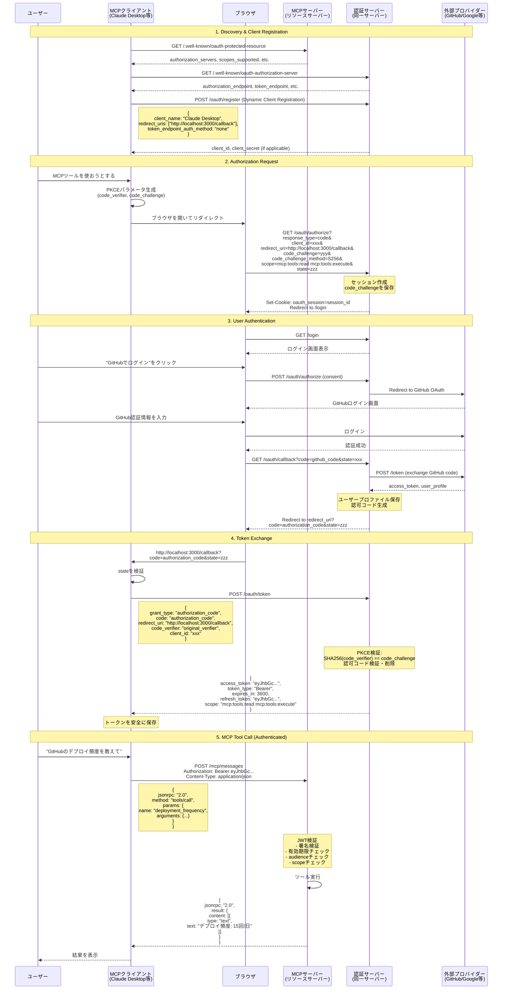
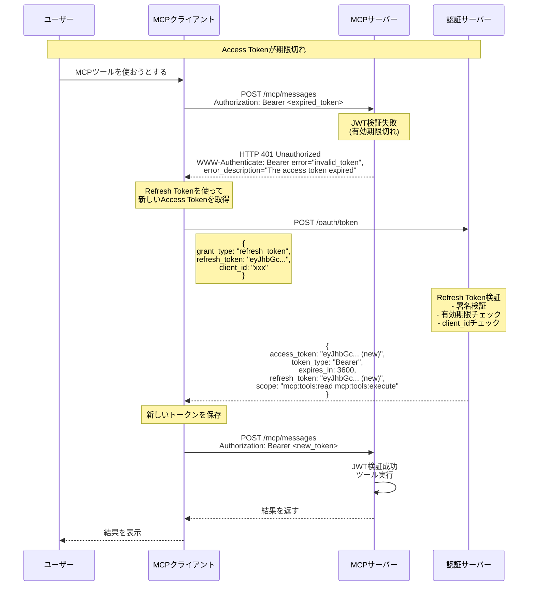
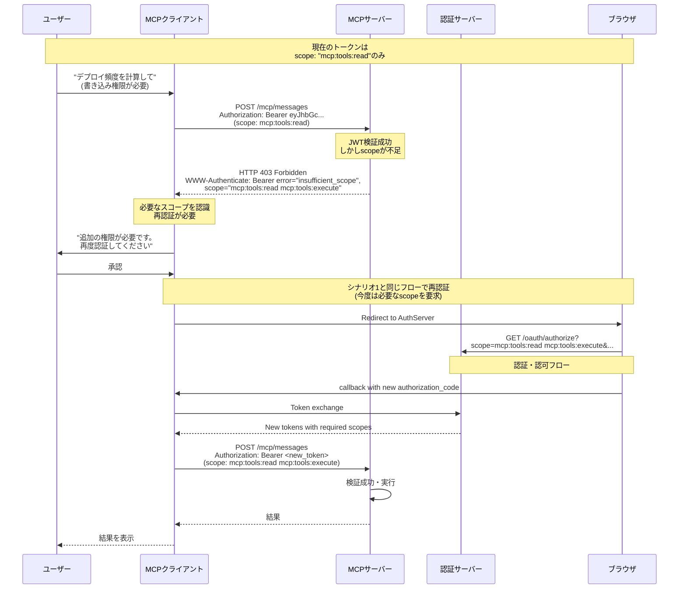
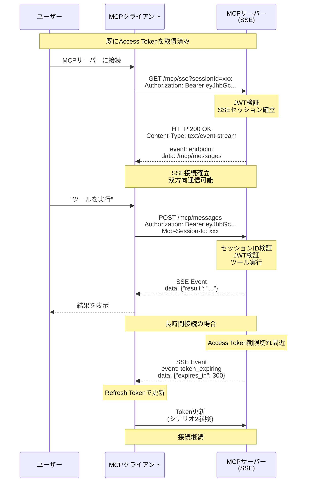

# MCP HTTP認証フローのシーケンス図

## シナリオ1: 初回接続 - OAuth 2.1 Authorization Code + PKCE フロー



## シナリオ2: トークン期限切れ - Refresh Token フロー



## シナリオ3: 権限不足 - Insufficient Scope エラー



## シナリオ4: SSE (Server-Sent Events) 接続での認証



## セキュリティのポイント

### 1. PKCE (Proof Key for Code Exchange)
- **目的**: 認可コード横取り攻撃の防止
- **仕組み**:
  - クライアントが`code_verifier`(ランダム文字列)を生成
  - `code_challenge = SHA256(code_verifier)`を計算
  - 認可リクエスト時に`code_challenge`を送信
  - トークン交換時に元の`code_verifier`を送信
  - サーバーが`SHA256(code_verifier) == code_challenge`を検証

### 2. State Parameter
- **目的**: CSRF攻撃の防止
- **仕組み**:
  - クライアントがランダムな`state`を生成
  - 認可リクエストに含める
  - コールバック時に同じ`state`が返ってくることを確認

### 3. JWT Validation
- **署名検証**: トークンが改ざんされていないか
- **Issuer検証**: 信頼できる発行者か
- **Audience検証**: このMCPサーバー向けのトークンか
- **有効期限**: トークンが期限切れでないか
- **Scope検証**: 必要な権限を持っているか

### 4. Origin Header Validation
- **目的**: DNS rebinding攻撃の防止
- **仕組み**: リクエストの`Origin`ヘッダーが許可されたオリジンか確認

## トークンのライフサイクル

```
Access Token  : 短命 (1時間程度)     → 頻繁に検証が必要な操作に使用
Refresh Token : 長命 (30日〜90日程度) → Access Token更新のみに使用
Authorization Code : 超短命 (10分程度) → 1回のみ使用可能
```

## 実装の優先順位

1. **必須**: OAuth 2.1 Authorization Code + PKCE フロー
2. **必須**: JWT検証 (署名、有効期限、audience、scope)
3. **必須**: Refresh Token フロー
4. **推奨**: Well-known エンドポイント
5. **推奨**: Dynamic Client Registration
6. **推奨**: Insufficient Scope エラーハンドリング
7. **オプション**: Token Revocation
